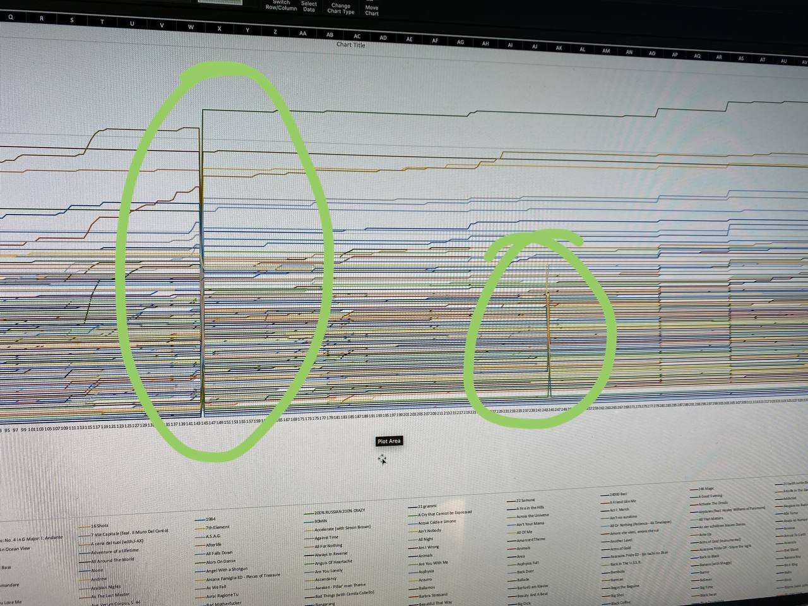
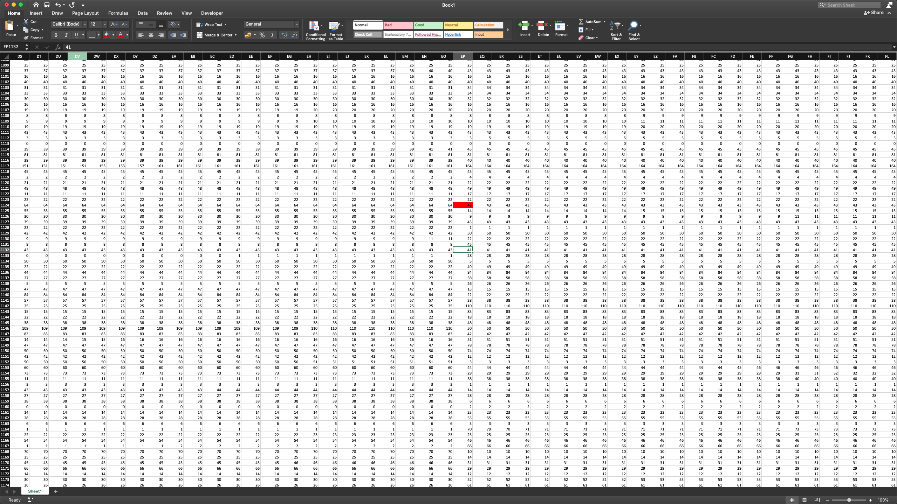
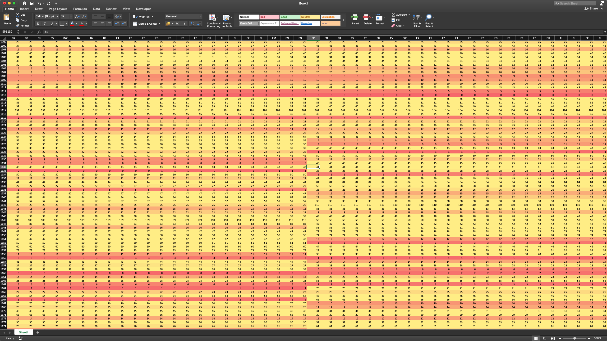
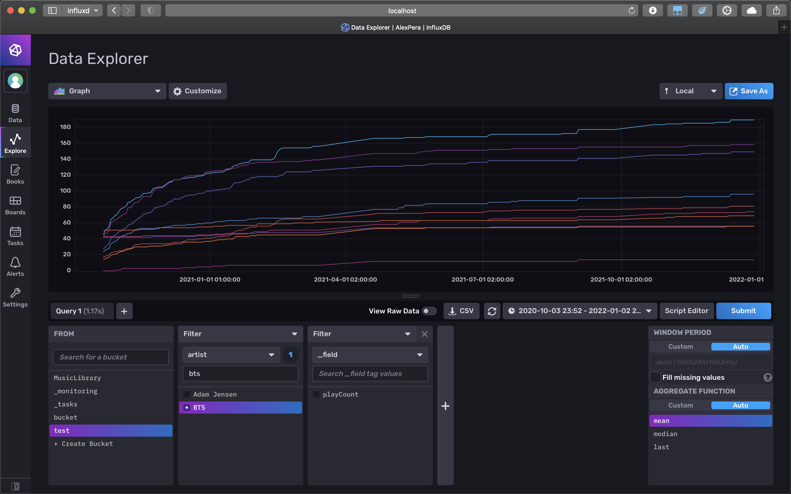

# Documenting music stats

Since October 2020 a script has been running on my machine daily:

```sh
/usr/bin/automator "/Users/alex/AppsMine/PythonTest Music/exportLibrary.workflow"
python3 "/Users/alex/AppsMine/PythonTest Music/csvcreator.py"
python3 "/Users/alex/AppsMine/PythonTest Music/plotcreator.py" 200 20 1
```

This does three things:

1. Use AppleScript to:
	1. get all the songs in the library and the respective play counts;
	2. save the result to a .txt file in the format:
		
		```
		song1
		song2
		
		playcount1
		playcount2
		```
2. Use Python to:
	1. parse the previously generated .txt file;
	2. update an exististing `out.csv` file.
3. Create a visual representation of the last column, which result is saved in a specific folder.

In this document we are mainly focusing on the first two steps, which are also the ones which have created quite some problems, thus bringing me to write this file.


## Applescript?

The existence of the first step could appear confusing: why use AppleScript to do such a simple thing, when you are forced to use python in the next step anyway?
<br>The fact is that since MacOS Catalina, iTunes doesn't sync automatically the xml file, used by third-party apps to access the library. It's still possible to retrieve this file, but that would mean interacting with the UI. This script, on the other hand, should run in the background (note that AppleScript implies that iTunes is running, if it's not, it will start. However, as iTunes is running almost always, it appears as if the script is completely in the background).
<br>There are some Python libraries which can do basic operations with iTunes, but they all use that xml file. Hence, the need for AppleScript. As soon as possible, though, I started using Python. The format of the output.txt file is arbitrary and doesn't really make any sense. In future updates it will switch to a .csv.

## Creating the csv

Parsing the file is not a problem. Handling new songs **is** a problem.

In the output file generated by AppleScript all the songs are alphabetically ordered. If some songs have the same name, they will always be retrieved in the same order. However, if a new song with an existing name gets added, we should make more complex operations to understand which is actually the playcount of the new and the old song.

I therefore decided to order the songs in alphabetical order, in blocks, depending on the date they were added.

The result is that recently added songs are going to the end of the file, while the old ones stay at the top, no matter what.

Due to my ignorance, I didn't know of the ability of putting empty values between delimiters. I therefore filled empty cells with `-1`.

As a delimiter I used a `,`. This was a pretty dumb decision as well. Many songs have in their title one or more commas. This could be solved by adding `"` to force a data field. However, it happened quite often that I would change the name of a song to contain a comma. By doing so, the csv file could get corrupted.

## Problems

In addition to the minor problems already listed above, some major raised:

Somewhere in the creation of the csv file something went terribly wrong. This becomes obvious when plotting the data:



This happened multiple times. As I would later find out these moments coincided with the addition of new songs to the library.

At some point I decided to fix this. I had already created a `checker.py` script, which would just check each row. If the previous column had a value higher than the current one, an error was returned, since it's impossible for the play count to get lower. When running this script, almost every song had (at least) one error in it.

```python
df = pd.read_csv('to_check.csv', ";")

df2 = pd.DataFrame()
for index, row in df.iterrows():
	l = row.tolist()[3:]
	if (l != sorted(l)):
		print(row['song'])
		print(l, sorted(l))
		df2 = df2.append(row)

if(len(df2) > 0):
	print(df2['song'])
else:
	print("Everything OK")

```

I used Excel to visualize the csv file in a better way. Scrolling through it was painful at first.



With some attention it's possible to see that some block of rows are basically shifted, by a number of rows.

At some point my eyes were hurting so I found a better way to work with this file:



By filling the cells with a color scale the shift becomes obvious.

This way I was able to recover some data.

## Solutions

I'm not really sure were the problem is. A csv file doesn't seem like a good solution anyway.<br>I therefore decided to find a different solution.

A database appeared like a good idea to store millions of data points.

I decided to use InfluxDB. Looked like a good solution as it's a time based db.

To run it I went for Docker.

The python script had to be changed to log the data to the db:

```python
list = fileData.split(";")[:-1]

with InfluxDBClient(url="http://localhost:8086", token=token, org=org) as client:
    write_api = client.write_api(write_options=SYNCHRONOUS)

    for i in range(0, len(list), 2):
        name = list[i]
        count = int(list[i+1])
        print("Adding " + name + " (" + str(count) + ")")

        point = Point(name) \
            .field("playCount", count) \
            .time(currTime, WritePrecision.NS)
        
        write_api.write(bucket, org, point)
```

As I'd later find out, this has one important problem: many songs have the same name. To fix this, I would update the AppleScript editor to also save the artist and the album in the txt file.
<br>The script would be updated accordingly:

```python
        name = list[i]
        artist = list[i+1] 
        album = list[i+2]
        count = int(list[i+3])
        ...
        point = Point(name) \
            .field("playCount", count) \
            .tag("artist", artist) \
            .tag("album", album) \
            .time(currTime, WritePrecision.NS)
```

-
I then tried recovering the corrupted old data. As it covers quite a long period of time (373 days) I felt like it was worth the time.

The processes was divided in:

1. Shifting as many rows as possible;
1. Removing rows which have missing data;
1. Removing rows of songs added in the last year (as those have the most problems, and require extra attention;
1. Writing a script to add that data to the DB.


The first step was definitely the most time consuming and frustrating. All the other steps felt quick, due to their interactivity.
<br>In the end I was able to recover 1568 songs, on a total of ~2200.

```python
with open('filledDataWoutEmptyRows.csv', encoding='UTF-16') as namesFile:
    df = pd.read_csv(namesFile, sep="\t")

df = df.replace(np.nan, "")

with InfluxDBClient(url="http://localhost:8086", token=token, org=org) as client:
    write_api = client.write_api(write_options=SYNCHRONOUS)
    for index, row in df.iterrows():
        name = row['song']
        artist = row['artist']
        album = row['album']
        
        for col in cols: #cols is a previously defined list with all the dates
            count = df[col][index]
            dateObj = datetime.strptime(col, "%Y%m%d")
            #write to db
```

Soon, the data is viewable in the Data Explorer in the browser:



-

Fixing the values of the songs added when the script was already running was not so easy. Not having a reference it would be impossibile to know by how much each row has shifted. I decided to handle this in python, by joining the old csv file with a dataframe containing the current values. This way, the last column should always be right (with the exception of songs with the same name, no idea how it's going to handle everything in those cases). Afterwards, I'll be using excel again and trying to find the shift patterns.


## Updating the Lingon script

Just change the python script to the one who adds the data to the DB instead of updating the csv. Removing other scripts as well.